<div align="center">

   

# ShonenX

### A Modern AniList & MyAnimeList Client

[](https://flutter.dev/)
[](https://dart.dev)
[](https://github.com/Darkx-dev/ShonenX/releases)
[](https://opensource.org/licenses/apache-2-0)
[](https://github.com/Darkx-dev/ShonenX/stargazers)
[](https://discord.gg/uJyXZYSmH4)

Track and manage your anime library with AniList and MyAnimeList integration. Built with Flutter for Android and Windows.

[Features](#-features) • [Screenshots](#-screenshots) • [Installation](#-installation) • [Contributing](#-contributing)

</div>

---

## ✨ Features

### 📊 Anime Tracking
- **AniList Integration** - Manage your anime library *(In Development)*
- **MyAnimeList Support** - MAL client features *(Early Development)*
- **Local Progress Tracking** - Continue watching without login
- **Watch History** - Track your viewing locally

### 🎨 Customization
- **Custom Design System** - Unique UI with smooth animations
- **Extensive Theming** - Wide range of theme options
- **Light/Dark Mode** - Comfortable viewing anytime
- **Advanced Settings** - Personalize your experience

### 🔌 Extensions
- **Mangayomi Extensions** - Anime-focused extension support *(Experimental)*
- **Built-in Sources** - Pre-configured providers
- **Jikan Sync** - Episode metadata *(Experimental)*

### 🔍 Search & Discovery
- **Advanced Search** - Comprehensive filtering
- **Content Filters** - Adult content toggle (off by default)
- **Continue Watching** - Resume where you left off

### 🌐 Platform Support
- **Android** - Fully supported mobile experience
- **Windows** - Native desktop build supported
- **Linux** - Experimental builds (via install script)
- **iOS/macOS** - Not planned currently

---

## 📸 Screenshots

<details>
<summary><b>📱 Android Screenshots (Click to expand)</b></summary>

<br/>

<div align="center">
<table>
  <tr>
    <td align="center">
      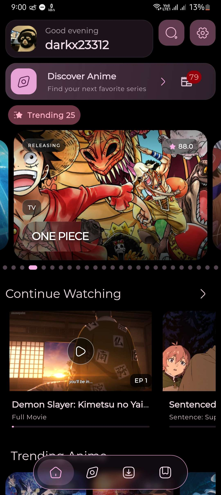
      <br/><b>Home</b>
    </td>
    <td align="center">
      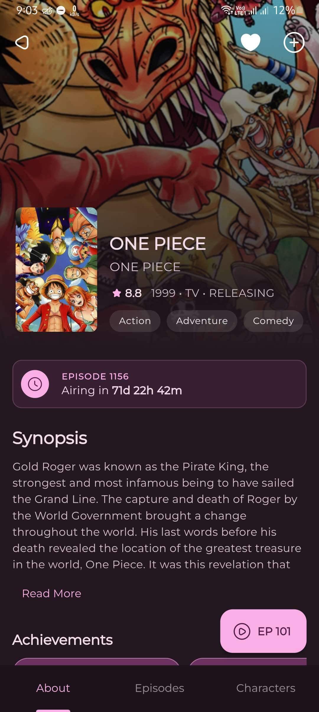
      <br/><b>Details</b>
    </td>
    <td align="center">
      
      <br/><b>Player</b>
    </td>
    <td align="center">
      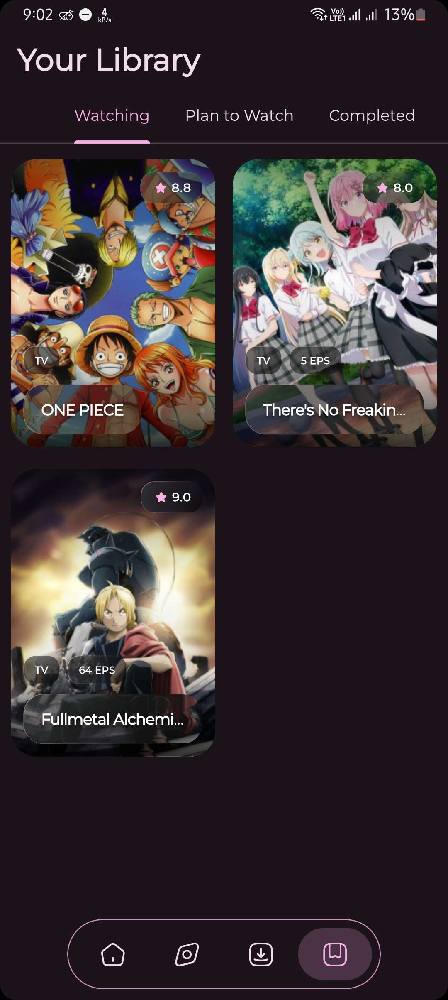
      <br/><b>AniList</b>
    </td>
  </tr>
  <tr>
    <td align="center">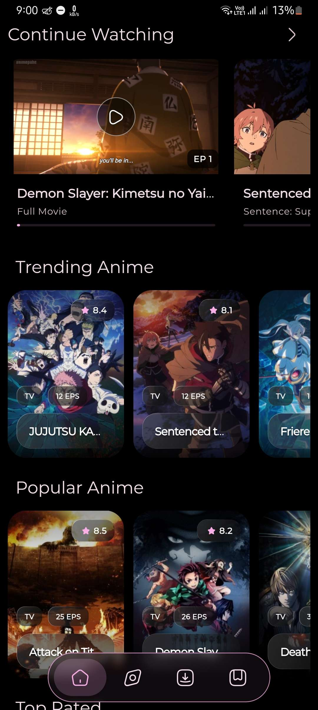</td>
    <td align="center">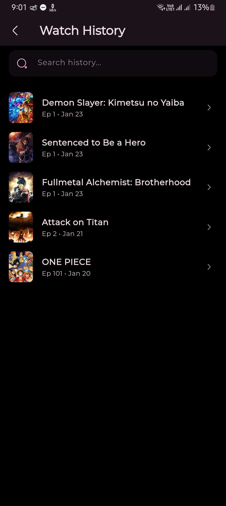</td>
    <td align="center">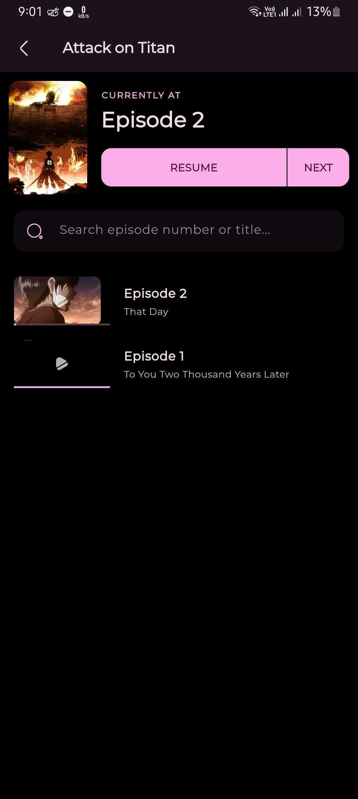</td>
    <td align="center">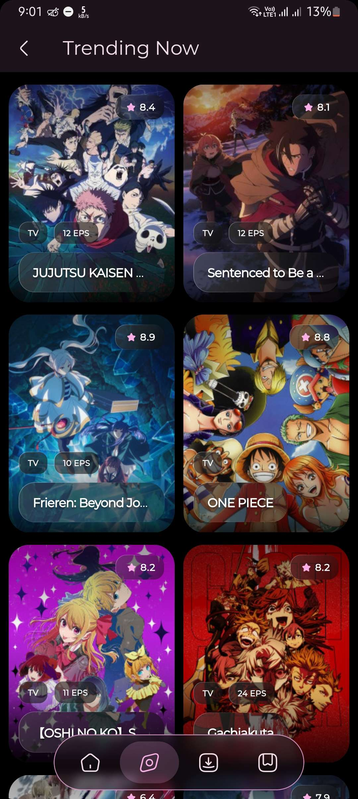</td>
  </tr>
  <tr>
    <td align="center">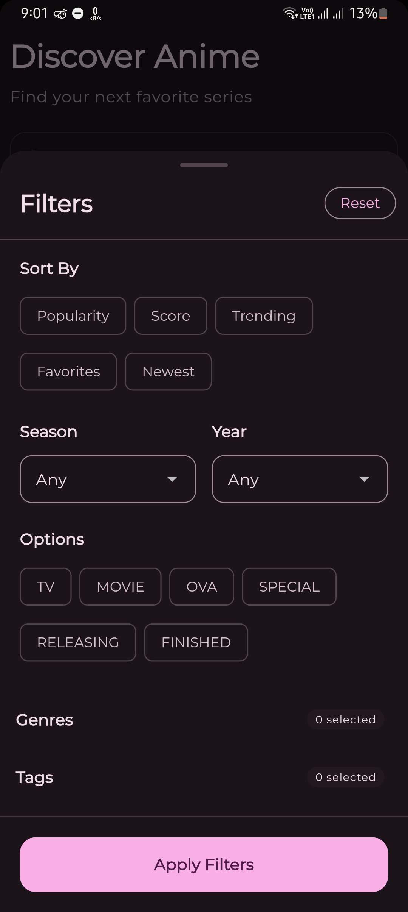</td>
    <td align="center">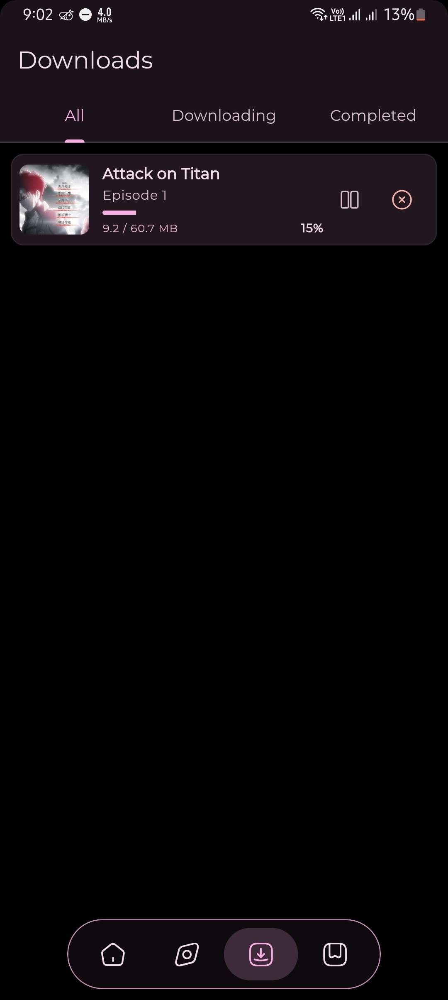</td>
    <td align="center"></td>
    <td align="center"></td>
  </tr>
  <tr>
    <td align="center">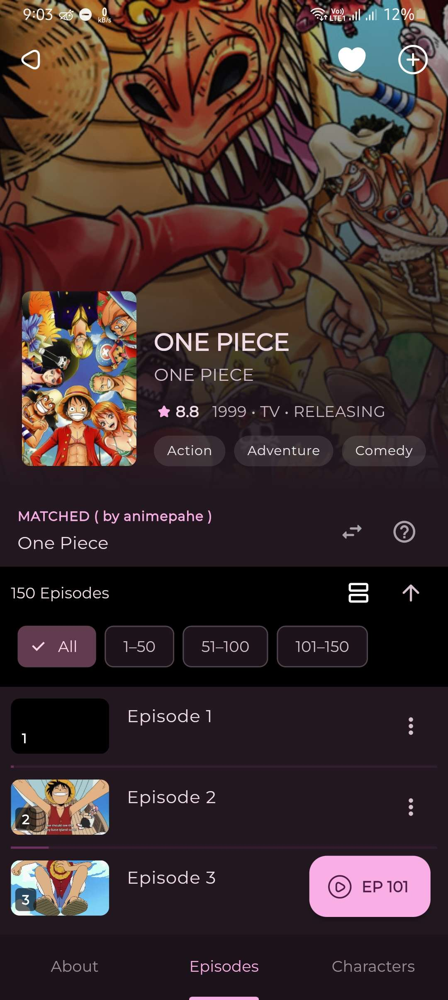</td>
    <td align="center">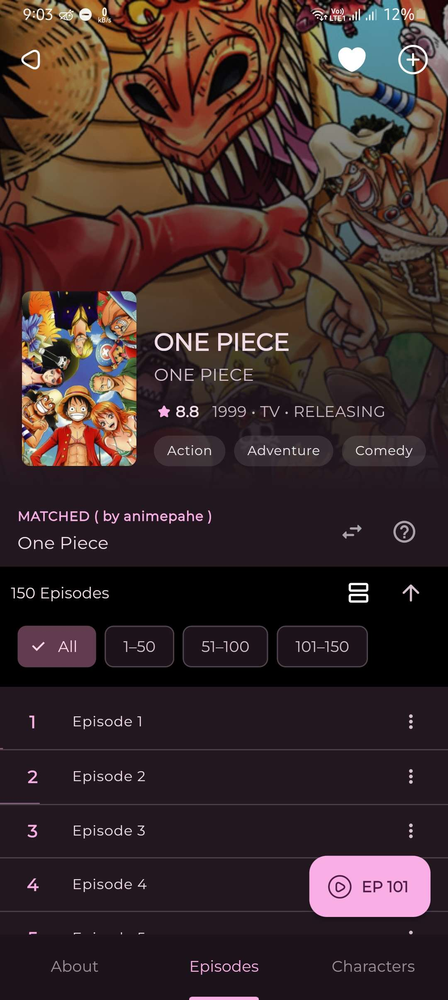</td>
    <td align="center">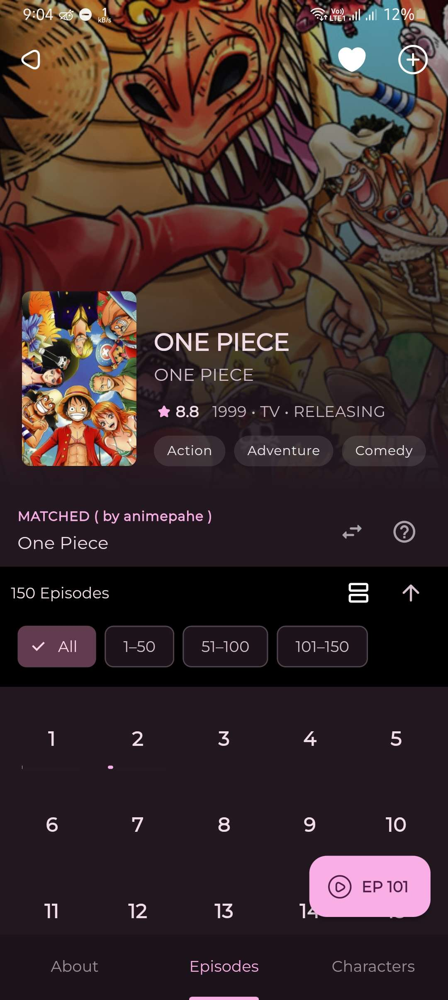</td>
    <td align="center">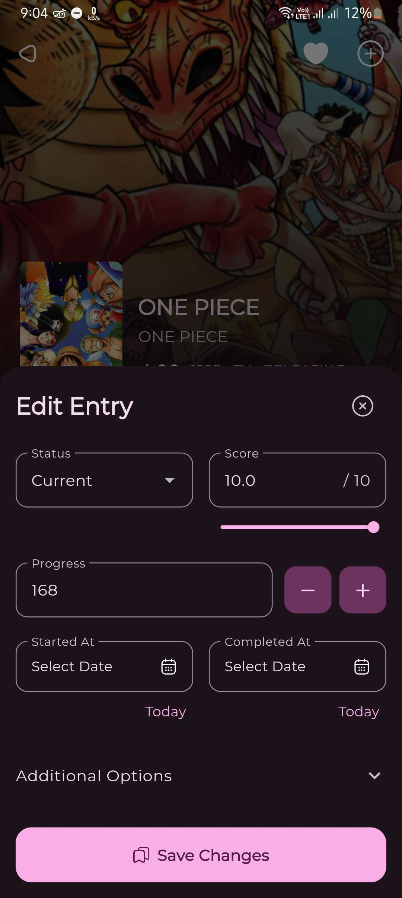</td>
  </tr>
  <tr>
    <td align="center">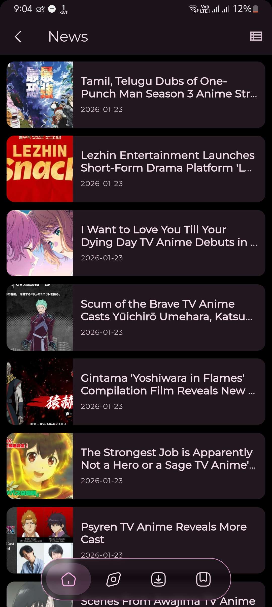</td>
    <td align="center"></td>
    <td align="center">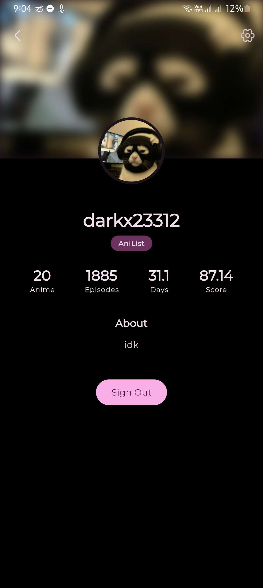</td>
    <td align="center">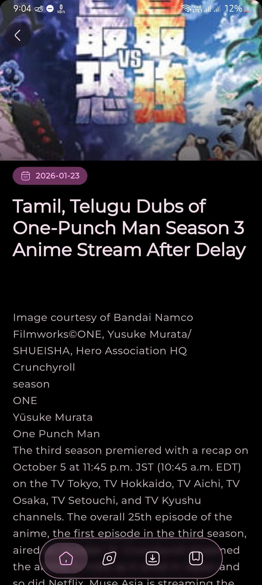</td>
  </tr>
  <tr>
    <td align="center">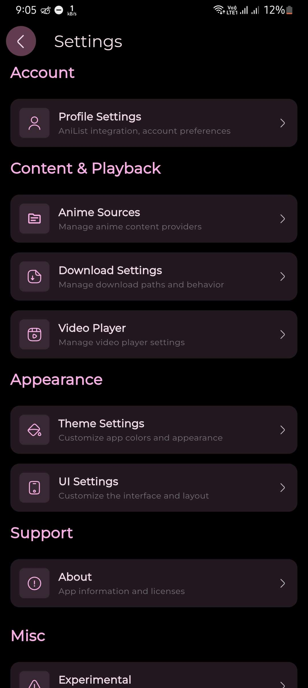</td>
    <td align="center">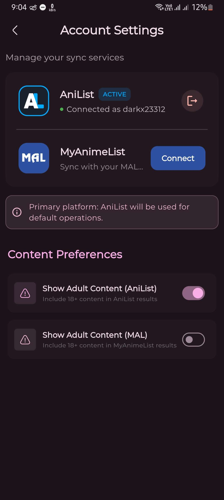</td>
    <td align="center">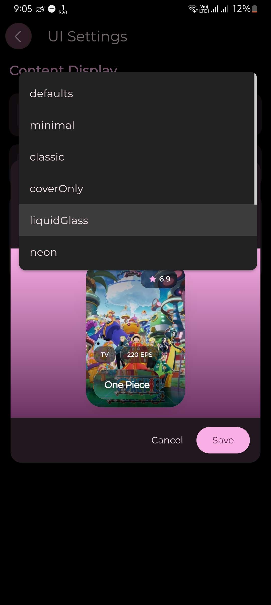</td>
    <td align="center"></td>
  </tr>
  <tr>
    <td align="center"></td>
    <td></td>
    <td></td>
    <td></td>
  </tr>
</table>
</div>

</details>

<details>
<summary><b>🖥️ Desktop Views (Windows/Linux)</b></summary>

<br/>

<div align="center">
<table>
  <tr>
    <td align="center">
      
      <br/><b>Home Screen</b>
    </td>
    <td align="center">
      
      <br/><b>Anime Details</b>
    </td>
  </tr>
  <tr>
    <td align="center">
      
      <br/><b>Video Player</b>
    </td>
    <td align="center">
      
      <br/><b>AniList Integration</b>
    </td>
  </tr>
</table>
</div>

</details>

---

## 🛠️ Technology Stack

**Framework**: Flutter ≥3.8.1 | **Language**: Dart ≥3.8.1 | **Version**: 1.7.5

<details>
<summary><b>View Key Dependencies</b></summary>

```yaml
dependencies:
  flutter_riverpod: ^3.0.1
  go_router: ^14.7.1
  hive_ce: ^2.16.0
  hive_ce_flutter: ^2.1.0
  media_kit: ^1.2.6
  media_kit_video: ^2.0.1
  graphql: ^5.2.3
  google_fonts: ^6.2.1
  cached_network_image: ^3.4.1
  isar_community: ^3.3.0
  dio: ^5.9.0
  flex_color_scheme: ^8.4.0
  dynamic_color: 1.7.0
```

</details>

---

## 🚀 Installation

### 📱 Android
Download the latest `.apk` from the [Releases](https://github.com/Darkx-dev/ShonenX/releases) page.

### 🪟 Windows
Download the `Windows-Portable.zip` or the `.exe` installer from the [Releases](https://github.com/Darkx-dev/ShonenX/releases) page.

### 🐧 Linux
Run the following command to install/update:
```bash
bash <(curl -fsSL https://raw.githubusercontent.com/Darkx-dev/ShonenX/main/install.sh)
```

### 🛠️ Build from Source
**Prerequisites**: Flutter SDK ≥3.8.1, Git
```bash
git clone https://github.com/roshancodespace/ShonenX.git
cd ShonenX
flutter pub get
flutter pub run build_runner build --delete-conflicting-outputs
flutter run # Select your device/platform
```

---

## 🤝 Contributing

Contributions welcome! Fork the repo, create a feature branch, and submit a PR.

---

## 📄 License

Apache 2.0 License - see [LICENSE](LICENSE) file.

---

## 📞 Support

**Developer**: Roshan Kumar  
**GitHub**: [@roshancodespace](https://github.com/roshancodespace)  
**Email**: roshan.codespace@gmail.com  
**Discord**: [Join Community](https://discord.gg/uJyXZYSmH4)

---

<div align="center">

### ⭐ Star this repo if you find it useful!

**Made with ❤️ by [Roshan Kumar](https://github.com/roshancodespace)**

</div>