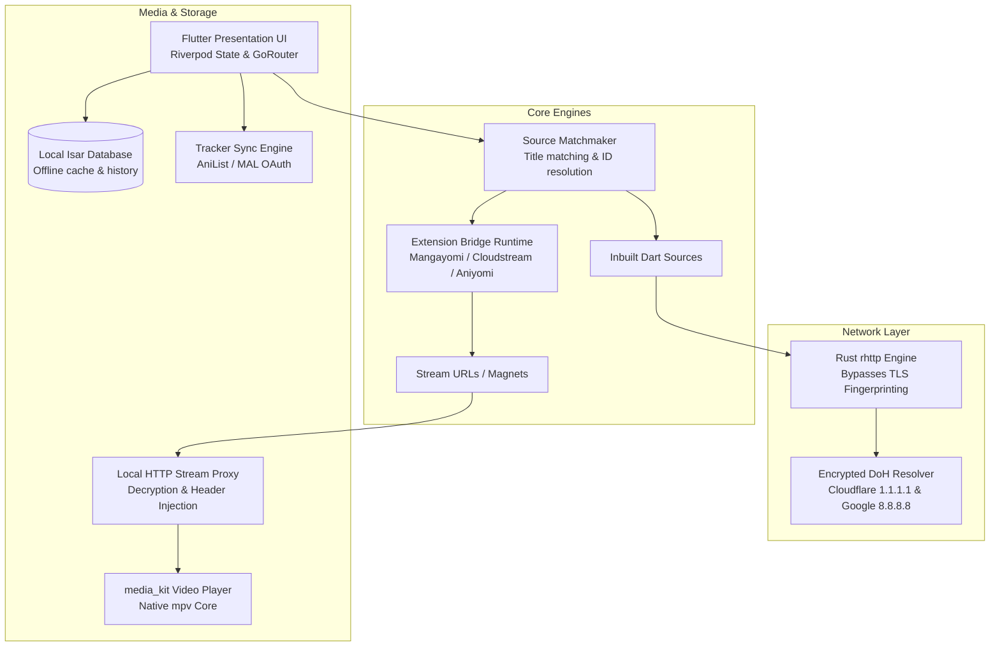

# Overview: The Story & Architecture of ShonenX

ShonenX started out as a solo project. Back when I first sat down to write it, the only anime/manga app I really knew about and used was **Aniyomi**. 

As I spent more time building and exploring the open-source community, I started watching other incredible projects in the ecosystem. I saw how **Mangayomi** tackled modular JavaScript scrapers, how **Cloudstream** engineered its stream resolution, and how different communities solved media playback and library management.

Instead of pretending to have all the answers or reinventing every wheel from scratch, I took a different approach: **watch what works, learn from the best apps out there, and combine those ideas into one cohesive, high-performance client.**

Today, ShonenX is a cross-platform anime and manga app built with Flutter. It brings together extension formats from multiple ecosystems, routes network traffic through a Rust-backed HTTP engine with built-in DNS-over-HTTPS (DoH), decodes 10-bit video and styled subtitles natively through `mpv`, and syncs progress across all major tracking services.

---

## The High-Level Architecture

Here is how the major subsystems connect when you run ShonenX:

---

## The Pillars of ShonenX

### 1. Combining the Best Extension Ecosystems
Each community has its own strengths. Aniyomi has years of established manga sources. Mangayomi has clean, portable scrapers. Cloudstream has great multi-stream extractors. Through the `anymex_extension_bridge`, ShonenX executes extensions from these different ecosystems right inside the app, so users aren't locked into one format.

### 2. Rust-Powered Networking & Encrypted DNS
Standard Dart HTTP clients have a known problem: their default TLS handshake fingerprints look like automated scripts to anti-bot systems like Cloudflare, often resulting in 403 Forbidden errors. 

To solve this cleanly, we use **Rust `rhttp`**, which handles requests through native TLS stacks that match real browsers. On top of that, we built in **DNS-over-HTTPS (DoH)** with Cloudflare and Google, preventing ISP-level DNS blocks and protecting query privacy.

### 3. Native Video Playback via `media_kit` (mpv)
Anime playback requires serious subtitle and video support. Anime releases frequently use Advanced SubStation Alpha (`.ass`) subtitles with custom styling, fonts, and positioning, as well as 10-bit HEVC video. We use **`media_kit`** (backed by native `mpv`), giving us hardware-accelerated decoding and pixel-perfect subtitle rendering across Android, Linux, and Windows.

### 4. Seamless Progress Syncing
Keeping progress in sync when you use services like AniList or MyAnimeList should be effortless. ShonenX's sync engine evaluates playback duration thresholds, queues updates locally in Isar when offline, and safely broadcasts progress across linked trackers without accidentally overwriting newer progress.

---

## Repository Map

The codebase is organized with strict layer boundaries to keep things modular as the app grows:

| Directory | What lives here |
| :--- | :--- |
| [`lib/core/`](https://github.com/roshancodespace/shonenx/tree/main/lib/core/) | Core plumbing: Rust networking (`rhttp`), DoH resolvers, Isar caching, GoRouter setup, and theme tokens. |
| [`lib/features/`](https://github.com/roshancodespace/shonenx/tree/main/lib/features/) | Feature slices (player, library, downloads, tracking). Each feature contains its own domain models, providers, and presentation screens. |
| [`lib/shared/`](https://github.com/roshancodespace/shonenx/tree/main/lib/shared/) | Reusable widgets (cards, lists, buttons) and shared models like `UnifiedMedia`. |
| [`lib/source_engine/`](https://github.com/roshancodespace/shonenx/tree/main/lib/source_engine/) | The orchestrator that normalizes raw extension payloads into clean, typed Dart models. |
| [`packages/anymex_extension_bridge/`](https://github.com/roshancodespace/shonenx/tree/main/packages/anymex_extension_bridge/) | The standalone runtime bridge that executes foreign extension logic natively in ShonenX. |

---

## Where to Head Next

- **Building locally:** Follow the [Local Setup Guide](/setup/) to get dependencies installed.
- **Architecture dive:** Read the [Architecture Walkthrough](/setup/architecture) to see how data and state flow through the app.
- **Deep dive on DoH:** Check out [DNS over HTTPS (DoH) & Client Injection](/systems/dns_over_https).
