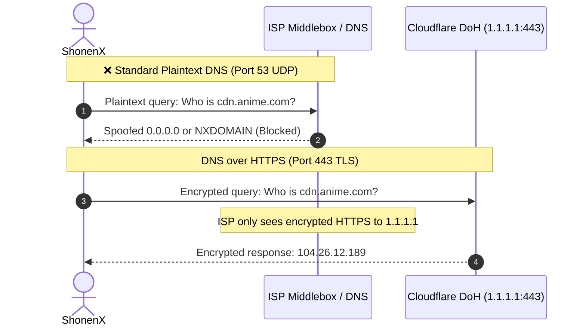
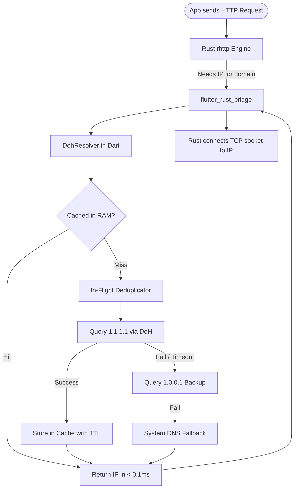

# DNS over HTTPS (DoH) & Client Injection

Domain Name System (DNS) resolution is a critical link in media aggregation. When network requests rely on standard system DNS, lookups can be vulnerable to ISP-level domain filtering, DNS poisoning, and unencrypted inspection.

To ensure reliable, privacy-preserving networking across all platforms, ShonenX implements an integrated **DNS over HTTPS (DoH)** resolver injected directly into its native Rust networking engine (`rhttp`).

---

## The Problem: Standard DNS Limitations

Traditional DNS operates over unencrypted UDP on port 53. In media and scraper applications, this presents three major challenges:

1. **DNS Poisoning & Regional Filtering:** When local networks or ISPs restrict access to media domains, they frequently manipulate DNS responses—returning `0.0.0.0`, redirecting to blocked notification pages, or replying with `NXDOMAIN`. To the client, this surfaces as an unresolvable `SocketException: Failed host lookup`.
2. **Unencrypted Query Inspection:** Because standard queries travel in plaintext, third-party network observers can monitor every domain the application accesses, even when the subsequent HTTP traffic uses HTTPS.
3. **Inconsistent Latency:** Sluggish or overloaded local ISP resolvers introduce noticeable delays to the initial connection phase of each API call and video segment request.



DNS over HTTPS (RFC 8484) addresses these issues by transmitting DNS queries over encrypted HTTPS connections (port 443), making lookups indistinguishable from standard secure web traffic.

---

## Architecture & Resolution Pipeline

ShonenX intercepts all domain resolution at the network layer and routes it through `DohResolver`:



---

## Resolving the Resolver: Direct IP SAN Certificates

A common circular dependency in DoH implementations is the bootstrap lookup:

> *If an HTTPS request to `https://cloudflare-dns.com/dns-query` is needed to resolve domains, how does the client resolve `cloudflare-dns.com` in the first place?*

If a client relies on standard DNS to resolve the hostname of the DoH provider, a restricted network could block that initial query, disabling DoH entirely.

### The Solution: Subject Alternative Name (SAN) IP Certificates
ShonenX bypasses hostname resolution by connecting directly to the provider's raw IP addresses:
- **Cloudflare:** `https://1.1.1.1/dns-query` and `https://1.0.0.1/dns-query`
- **Google:** `https://8.8.8.8/resolve` and `https://8.8.4.4/resolve`

Both Cloudflare and Google maintain official TLS certificates issued directly for their raw IP addresses as **Subject Alternative Names (SAN)**. The client validates the TLS certificate directly against the IP literal during the handshake, eliminating the need for an initial DNS lookup.

---

## Dynamic Injection into the Rust Client (`rhttp`)

ShonenX uses [`rhttp`](https://pub.dev/packages/rhttp) for HTTP networking. Because `rhttp` runs on native Rust (`reqwest` and `hyper`), standard socket calls would ordinarily fall back to the operating system's default C library resolver (`getaddrinfo`).

We utilize `rhttp`'s dynamic DNS callback to route all Rust socket lookups back into `DohResolver`:

```dart
// lib/core/network/http_client.dart
class HTTP {
  HTTP._internal({CacheManager? cacheManager, DohResolver? dohResolver})
    : _dohResolver = dohResolver ?? DohResolver.instance,
      _client = rhttp.RhttpClient.createSync(
        settings: rhttp.ClientSettings(
          throwOnStatusCode: false,
          userAgent: NetworkConfig.globalUserAgent,
          tlsSettings: const rhttp.TlsSettings(verifyCertificates: false),
          timeoutSettings: const rhttp.TimeoutSettings(
            timeout: Duration(seconds: 30),
            connectTimeout: Duration(seconds: 15),
          ),
          // Dynamic DNS Injection:
          dnsSettings: rhttp.DnsSettings.dynamic(
            resolver: (host) =>
                (dohResolver ?? DohResolver.instance).resolve(host),
          ),
        ),
      ),
      _cache = cacheManager;
}
```

Every HTTP request initiated by scrapers, video players, or tracker clients automatically resolves through DoH without changing application-level code.

---

## Performance & Reliability Optimizations

To ensure sub-millisecond lookups and prevent performance degradation during multi-segment media playback:

### 1. In-Memory Caching (`DohCache`)
Resolved records are cached in memory using the TTL returned by the DNS response:
- Video players requesting dozens of consecutive `.ts` segments incur a network lookup only on the initial request. Subsequent queries resolve from RAM in **< 0.1ms**.
- **TTL Clamping:** Minimum TTL is clamped to 60 seconds (preventing resolver spam on abnormal records), and maximum TTL is capped at 3600 seconds (preventing stale IPs).

### 2. Request Deduplication
When screens load multiple media cards or covers concurrently, multiple network calls target the same host simultaneously. `DohResolver` uses Dart `Completer` instances to latch concurrent queries onto a single in-flight future, firing only one upstream DoH query per host.

### 3. Loopback & Direct IP Bypass
Lookups for `127.0.0.1`, `localhost`, or direct IPv4/IPv6 literals immediately return without initiating any network activity.

### 4. Resilient Fallback Hierarchy
If a captive portal, hotel network, or enterprise firewall blocks outbound TLS connections to public DNS IPs:
1. Queries attempt the primary IP (`1.1.1.1` or `8.8.8.8`) with a 3.5s timeout.
2. On failure, queries failover to the secondary IP (`1.0.0.1` or `8.8.4.4`).
3. If both endpoints fail, the resolver quietly falls back to native `InternetAddress.lookup(host)`.

---

## User Configuration & Diagnostics

Users can select their preferred provider in **Settings → Security & Privacy → Network & DNS**:

| Provider Option | Description |
| :--- | :--- |
| **Cloudflare (Default)** | Queries `1.1.1.1` / `1.0.0.1` via DNS JSON API. Strict zero-logging policy. |
| **Google** | Queries `8.8.8.8` / `8.8.4.4` via Google DNS over HTTPS API. Global failover option. |
| **System (Disabled)** | Bypasses DoH and uses standard OS DNS resolution. |

The settings screen includes a **"Test DNS Resolution"** diagnostic tool that performs a live lookup, displaying resolved IP addresses and round-trip latency in milliseconds.

---

## Implementation Files

- **Resolver engine:** [`lib/core/network/doh/doh_resolver.dart`](https://github.com/roshancodespace/shonenx/blob/main/lib/core/network/doh/doh_resolver.dart)
- **In-memory TTL cache:** [`lib/core/network/doh/doh_cache.dart`](https://github.com/roshancodespace/shonenx/blob/main/lib/core/network/doh/doh_cache.dart)
- **Provider configurations:** [`lib/core/network/doh/doh_provider.dart`](https://github.com/roshancodespace/shonenx/blob/main/lib/core/network/doh/doh_provider.dart)
- **Preferences notifier:** [`lib/shared/providers/doh_prefs_provider.dart`](https://github.com/roshancodespace/shonenx/blob/main/lib/shared/providers/doh_prefs_provider.dart)
- **HTTP client injection:** [`lib/core/network/http_client.dart`](https://github.com/roshancodespace/shonenx/blob/main/lib/core/network/http_client.dart)
- **Settings UI:** [`lib/features/settings/presentation/security_settings_screen.dart`](https://github.com/roshancodespace/shonenx/blob/main/lib/features/settings/presentation/security_settings_screen.dart)
- **Unit & integration test suite:** [`test/core/network/doh_resolver_test.dart`](https://github.com/roshancodespace/shonenx/blob/main/test/core/network/doh_resolver_test.dart)
