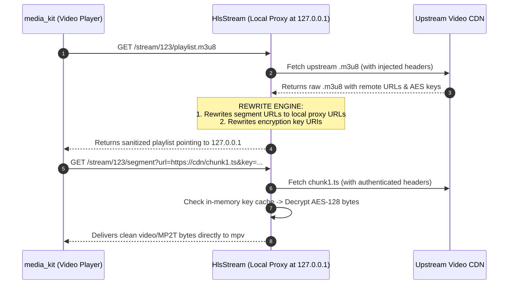

# Handling Protected HLS Streams

HTTP Live Streaming (HLS) delivers video by breaking media into short segments referenced by an `.m3u8` playlist.

While HLS is standard for adaptive streaming, third-party video hosts frequently implement protections that complicate playback in native media players:
1. **Header Validation on Segments:** Upstream CDNs often require specific `Referer`, `Origin`, or cookie headers. While player engines can pass custom headers to the initial `.m3u8` request, they may not forward them to individual child segment URLs.
2. **AES-128 Key Restrictions:** Segments are often encrypted with AES-128 (`#EXT-X-KEY`), requiring decryption keys that are protected behind authenticated endpoints or CORS restrictions.

To handle these streams reliably, ShonenX routes HLS requests through its **Local Stream Proxy** using `HlsStream`.

---

## Stream Interception & Rewriting



---

## Request Handling Stages

When an HTTP request hits the local proxy for an HLS stream, `HlsStream.handleRequest()` evaluates the action:

### 1. Playlist Processing (`action == 'playlist.m3u8'`)
When the player requests the master playlist, `HlsPlaylist.processPlaylist()`:
1. Downloads the upstream `.m3u8` using our Rust `HTTP` client (attaching all required headers).
2. Parses the playlist contents line-by-line.
3. Rewrites every video chunk URL to point back to the local proxy:
   ```
   Original:  https://remote-cdn.com/stream/chunk_001.ts
   Rewritten: http://127.0.0.1:4050/stream/123/segment?url=https%3A%2F%2Fremote-cdn.com%2Fstream%2Fchunk_001.ts
   ```
4. Rewrites `#EXT-X-KEY` URIs so that key retrieval also routes through the proxy.
5. Returns the modified playlist to the player.

### 2. Segment Retrieval & Decryption (`action == 'segment'`)
When the player requests a segment from `127.0.0.1`:
1. **Download:** The proxy downloads the segment using our authenticated HTTP client.
2. **Key Caching:** If encryption is active, the proxy checks its in-memory `_keyCache`. If absent, it fetches the 16-byte key once and caches it, avoiding repeated key lookups across hundreds of segments.
3. **Decryption:** The proxy passes the encrypted segment bytes, key, and IV to `HlsCrypto.decrypt()`.
4. **Piping Bytes:** Clean, decrypted MPEG-TS bytes are streamed directly to `media_kit` with `Content-Type: video/MP2T`.

From the video player's perspective, it is streaming an unencrypted video file directly from `localhost`, bypassing CDN header restrictions cleanly.
