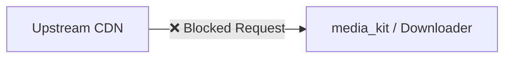

# Local HLS Proxy Server

ShonenX implements a lightweight, ephemeral **Local HLS Proxy Server** (HTTP) to intercept and stream HLS (`.m3u8`) playlists. 

::: info Why do we need this?
This system primarily resolves strict upstream Content Delivery Network (CDN) blocking—such as **Cloudflare challenges**, **referrer checks**, and **proprietary AES-128 encryption**—that native media players (like `media_kit`/mpv) and standard HTTP downloaders fail to handle natively.
:::

## Architecture

Instead of feeding upstream HLS URLs directly to the player or downloader (which often fails):



ShonenX routes the stream through an internal proxy hosted dynamically on `127.0.0.1`, which utilizes our `rhttp` wrapper to bypass Cloudflare:

```mermaid
graph LR
    A[Upstream CDN] <-->|✅ Allowed (rhttp)| B((Local HLS Proxy))
    B <-->|✅ Local Stream| C[media_kit / Downloader]
```

---

## Components

The HLS proxy is built on four core components located in [`lib/core/network/hls_server`](https://github.com/shonenx/shonenx/tree/main/lib/core/network/hls_server):

*   **`HlsServer`** (`hls_server.dart`)
    The central orchestrator. It spins up a `dart:io` `HttpServer` on an ephemeral loopback port (`127.0.0.1:0`). It routes incoming `GET` requests to the correct stream based on a unique ID.
*   **`HlsStream`** (`hls_stream.dart`)
    Represents a registered streaming session. It holds the upstream URL, mandatory HTTP headers (like `Referer` or `User-Agent`), and caches AES encryption keys in memory to minimize redundant upstream requests.
*   **`HlsPlaylist`** (`hls_playlist.dart`)
    The playlist parser and re-writer. It intercepts the master and variant `.m3u8` playlists, rewrites all segment URLs (`.ts`) and encryption key URIs to point to the local proxy (`127.0.0.1`), and forwards the rewritten playlist to the player.
*   **`HlsCrypto`** (`hls_crypto.dart`)
    The decryption engine. If a segment is encrypted using `AES-128`, the proxy intercepts the segment, downloads it securely using `rhttp`, decrypts it on the fly, and streams the raw bytes to the local client.

---

## Workflow

### 1. Flagging a Stream
A `VideoStream` object includes a `requiresHlsServer` boolean flag. If an extractor (like the AnimePahe `Kwik` extractor) knows its stream is protected by Cloudflare or strict headers, it sets this flag to `true`.

```dart
// lib/shared/models/video_stream.dart
VideoStream(
  url: kwikUrl,
  quality: '1080p',
  requiresHlsServer: true, // Triggers the proxy workflow!
)
```

### 2. Registration
Before playback or downloading begins, the consumer (e.g., `PlayerController` or `DownloadManagerNotifier`) registers the stream with the `HlsServer` and receives a localized playback URL.

```dart
// Snippet from lib/features/player/providers/player_controller.dart
final server = ref.read(hlsServerProvider);
final localhostUrl = await server.register(
  id: uniqueStreamId,
  url: upstreamUrl,
  headers: streamHeaders, // e.g., {'Referer': 'https://kwik.cx'}
);

// The player now opens: http://127.0.0.1:43092/stream/123/playlist.m3u8
player.open(Media(localhostUrl));
```

### 3. Playlist Rewriting
When the player requests `playlist.m3u8`, the server fetches the real playlist using the injected headers via our Cloudflare-bypassing `HTTP` wrapper. It rewrites the contents:

::: code-group
```text [Original Upstream]
#EXTM3U
#EXT-X-KEY:METHOD=AES-128,URI="https://kwik.cx/key",IV=0x000...
https://cdn.example.com/segment_001.ts
```

```text [Rewritten Local]
#EXTM3U
#EXT-X-KEY:METHOD=AES-128,URI="http://127.0.0.1:43092/stream/123/segment?url=encoded_key_url",IV=0x000...
http://127.0.0.1:43092/stream/123/segment?url=encoded_segment_url
```
:::

### 4. Segment Decryption
When the player requests a `.ts` segment from the local proxy, `HlsStream.processSegment` downloads it using the cached headers. If the segment is AES-128 encrypted, `HlsCrypto.decrypt` processes the chunk on the fly and pipes the clean video bytes back to the player.

---

## Server Lifecycle & Auto-Shutdown

To prevent memory leaks and dangling ports, `HlsServer` manages its own lifecycle using a **5-minute inactivity timer**.

::: tip Seamless Resumption
This ephemeral design allows `DownloadManagerNotifier` to safely resume background downloads upon app restart! It simply re-registers the upstream URL and spins up a new port effortlessly without keeping an old dead port in the database.
:::

1. Every time a stream is **registered**, the timer resets.
2. Every time a **playlist, segment, or key is requested**, the timer resets.
3. If no requests hit the server for **5 minutes** (e.g., the user paused the video for a long time or destroyed the player without unregistering), the server automatically shuts down, releasing the port and clearing all stream cache.
