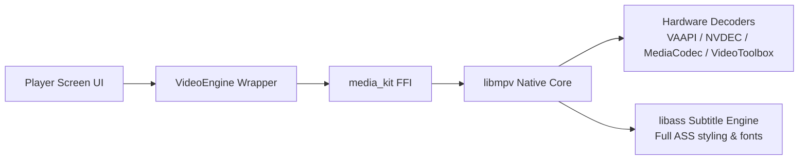
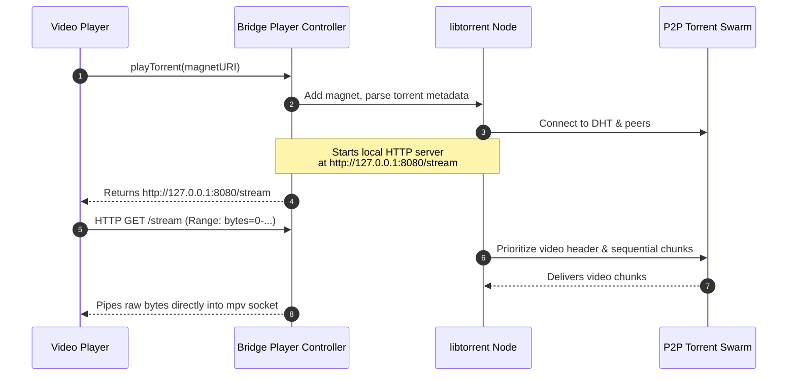

# Media Playback & Downloads

Media playback in ShonenX requires handling diverse formats: direct HTTP streams, adaptive HLS playlists, and peer-to-peer torrents. 

To provide a smooth viewing experience across mobile and desktop, ShonenX uses **`media_kit`** for playback and a background isolate architecture for downloads.

---

## The Video Engine: Powered by `media_kit` (mpv)

Rather than relying on default platform players that lack advanced subtitle features, ShonenX uses **`media_kit`**, which binds directly to native **`libmpv`** via FFI.



### Why `libmpv` is Ideal for Anime:
- **Comprehensive Subtitle Support:** Through `libass`, styled Advanced SubStation Alpha (`.ass`) subtitles—including custom fonts, positioning, and typesetting—render accurately.
- **Hardware-Accelerated Decoding:** Leverages zero-copy GPU decoders across Android (MediaCodec), Windows (D3D11VA), Linux (VAAPI/NVDEC), and macOS (VideoToolbox).
- **Format Flexibility:** Easily handles MKV containers, HLS playlists, multiple audio tracks, and embedded fonts.

Playback controls are wrapped inside `lib/features/player/engine/video_engine.dart`. The UI layer interacts with providers rather than raw player handles:

```dart
// Control playback state through Riverpod
ref.read(videoEngineProvider).pause();
ref.read(videoEngineProvider).seekTo(const Duration(minutes: 14, seconds: 30));
```

---

## Sequential Torrent Streaming

ShonenX supports streaming video directly from peer-to-peer torrents without waiting for the entire file to download.

Because video players expect standard HTTP or file stream inputs, the `anymex_extension_bridge` uses an embedded **`libtorrent`** node with a local HTTP loopback server:



1. The extension resolves a magnet link or `.torrent` file.
2. The bridge initiates a local HTTP server bound to `127.0.0.1`.
3. The torrent engine sets **sequential piece priority**, fetching the container header and opening minutes first.
4. `media_kit` connects to the local URL (`http://127.0.0.1:8080/stream`), buffering and playing seamlessly as new chunks arrive from the swarm.

---

## Offline Downloads: Background Isolates

Downloading anime episodes often involves HLS playlists containing hundreds of 4-second `.ts` segments, frequently encrypted with AES-128.

### Keeping the UI Responsive
Fetching, decrypting, and assembling hundreds of segments on the main UI thread would cause frame drops. 

ShonenX moves download workloads off the main thread:
1. When a download begins, the UI records a `DownloadTask` in the local **Isar database**.
2. The `M3U8DownloadEngine` spawns a dedicated background Dart isolate using `flutter_isolate`.
3. The background isolate:
   - Fetches segments concurrently using multiple connections.
   - Caches the AES-128 key and decrypts segments in memory.
   - Appends data into a consolidated video file.
   - Periodically updates task progress in Isar.
4. The `downloadProvider` observes the Isar collection and updates the Downloads screen reactively.

Because `downloadProvider` is persistent, downloads continue uninterrupted when users navigate between screens or browse other media.
