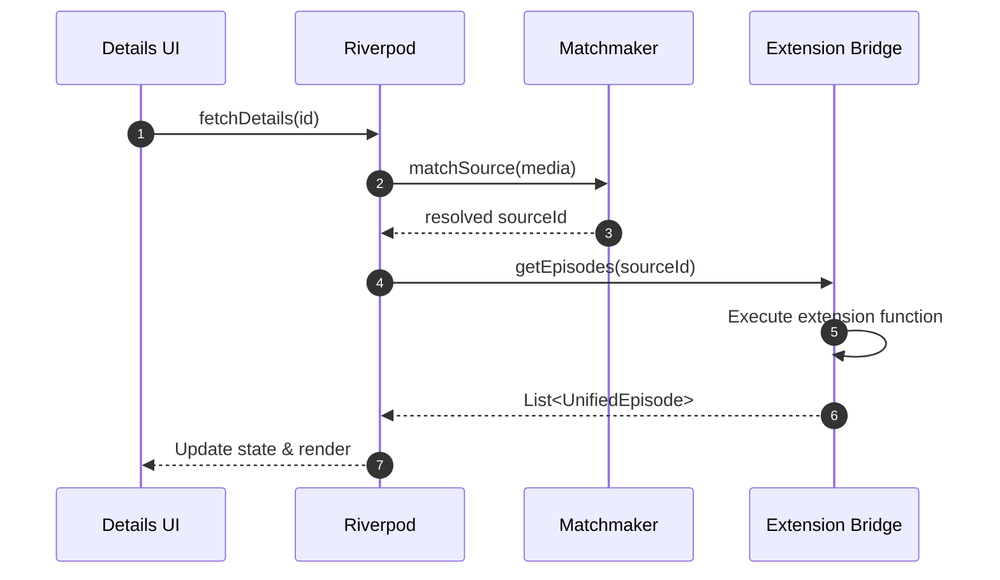

# The Source Engine: Bridging Extension Ecosystems

The open-source anime and manga community has produced several incredible extension ecosystems:
- **Mangayomi** (scrapers written in JavaScript and Dart)
- **Cloudstream** (scrapers written in Kotlin and Java)
- **Aniyomi / Tachiyomi** (mature manga scrapers with extensive catalog coverage)

Each community has its own architecture, package format, and runtime environment. 

Rather than reinventing these scrapers from scratch or locking users into a single format, ShonenX features the **Source Engine** (`lib/source_engine/`) and the **`anymex_extension_bridge`**. 

This subsystem acts as a unified facade that executes extensions from these different ecosystems and normalizes their outputs into consistent, strongly-typed Dart models.

---

## How a Request Flows Through the Engine

When a user opens a media title to view chapters or episodes, the request travels through a concise resolution pipeline:

---

## Key Components

### 1. The Matchmaker (`MatchService`)
A common issue in media aggregation is title discrepancies across providers. For example, AniList may index a series under its localized English title (*Attack on Titan*), while a scraper indexes it under its Japanese Romaji title (*Shingeki no Kyojin*).

The `MatchService` (`lib/source_engine/matchmaker/match_service.dart`) handles title resolution:
- Normalizes punctuation, strips season tags (*Season 2*, *Part 3*), and tests alternate synonyms.
- Evaluates title similarity using Levenshtein distance and token matching.
- Caches successful mappings in the local Isar database to ensure subsequent queries resolve immediately.

### 2. The Source Registry (`SourceRegistry`)
The registry catalogs all active sources. When ShonenX launches, both internal Dart sources and dynamic extensions register their capabilities:
- Supported media types (Anime, Manga, Novels).
- Extraction features (direct stream URLs, multi-quality options, chapter downloads).
- User enable/disable preferences.

### 3. The Extension Bridge (`packages/anymex_extension_bridge`)
The bridge runs as an independent local Dart package that embeds a lightweight JavaScript engine (QuickJS) and native platform bindings:
1. Loads the extension script and execution manifest.
2. Invokes the scraper's search or detail extraction functions in an isolated sandbox.
3. Deserializes the resulting JSON into ShonenX's typed **`UnifiedMedia`** and **`UnifiedChapter`** objects.

---

## Maintaining and Updating Sources

- **Inbuilt Dart Sources:** Located in `lib/source_engine/inbuilt_sources/`. If an internal source requires selector adjustments, update the parsing methods directly.
- **Dynamic Extensions:** Extensions maintained by upstream communities (Mangayomi, Cloudstream, etc.) are updated via the **Extensions** menu in Settings when new repository releases are published.
