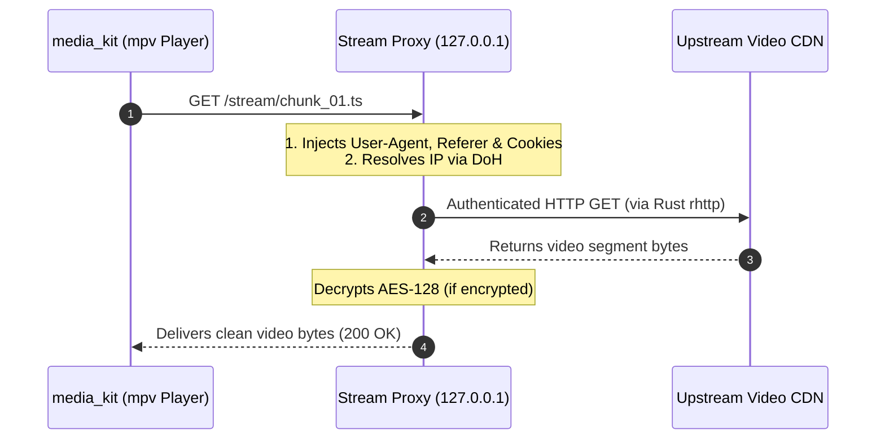

# Local Stream Proxy: Handling CDN Headers & Stream Processing

An ongoing challenge in media application development is handling upstream video hosts that enforce strict anti-hotlinking protections.

Native media players (like `media_kit` / `mpv`) excel at hardware-accelerated video decoding. However, their built-in network stacks are not designed to handle complex header injection, cookie sessions, or on-the-fly decryption across dynamic playlist segments.

When a video host demands specific `Referer`, `Origin`, and `Cookie` headers—or encrypts video chunks with proprietary keys—standard video players often fail with HTTP 403 Forbidden errors.

To solve this cleanly, ShonenX includes a **Local Stream Proxy Server**.

---

## How the Local Stream Proxy Works

Instead of feeding the media player a remote CDN URL that it cannot authenticate, ShonenX starts an ephemeral, lightweight HTTP server on the device at `http://127.0.0.1:PORT`.

The media player connects to this local loopback server as if it were streaming a standard local video file:



The proxy acts as an intermediary: it intercepts player requests, attaches all necessary headers and session tokens, fetches the data using our Rust `rhttp` client, decrypts encrypted chunks, and feeds clean video bytes back into the player.

---

## The `ProxyStream` Contract

The proxy server itself is protocol-agnostic. It does not need to know the specific details of whether a stream is HLS (`.m3u8`), DASH (`.mpd`), or a direct video file.

Requests are routed through the abstract `ProxyStream` interface:

```dart
abstract class ProxyStream {
  final String id;
  final String upstreamUrl;

  ProxyStream({required this.id, required this.upstreamUrl});

  // 1. Returns the local loopback URL the player should connect to:
  String getLocalUrl(int port);

  // 2. Handles incoming HTTP requests from the player:
  Future<void> handleRequest(HttpRequest request, HTTP httpClient, int port);
}
```

When a new streaming session begins:
1. The stream engine registers an implementation (like `HlsStream`) with the `StreamServer`.
2. The server assigns an ephemeral port and unique stream ID.
3. The player is handed the local loopback URL (e.g. `http://127.0.0.1:4050/stream/123/playlist.m3u8`).
4. When playback ends, the proxy unregisters the stream and releases the connection pool.

---

## Implementation Files

- **Proxy server lifecycle:** [`lib/core/services/stream_proxy/stream_server.dart`](https://github.com/roshancodespace/shonenx/blob/main/lib/core/services/stream_proxy/stream_server.dart)
- **Stream interface:** [`lib/core/services/stream_proxy/proxy_stream.dart`](https://github.com/roshancodespace/shonenx/blob/main/lib/core/services/stream_proxy/proxy_stream.dart)
- **HLS implementation:** [Handling Protected HLS Streams](./hls_implementation.md)
